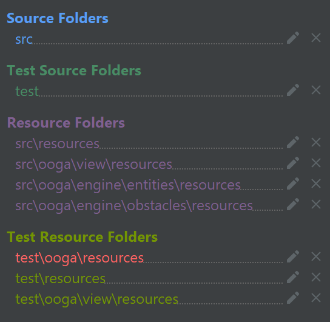
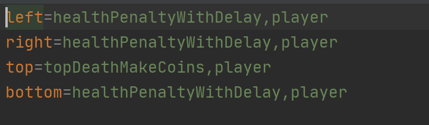

Object Oriented Game Architecture
====

This project implements a general architecture that can be used to create many different types of platformer type games. 3 games were created using the architecture: Mario, Lost Viking, Metroid. The architecture uses a low-code solution and a new game can be created entirely of data files.

### Basic Demo of Games Created

Mario:

https://user-images.githubusercontent.com/48296928/126908575-9fb70438-bf4c-421b-8ad6-569be76bdc00.mp4

Lost Vikings:

https://user-images.githubusercontent.com/48296928/126908583-482927d1-2722-4240-9fa9-4bfda5fa07cc.mp4

Metroid:

https://user-images.githubusercontent.com/48296928/126908586-5231a174-3eff-44c7-804e-c13b5ac25940.mp4

### Adding new game variation

There are a number of things that can be changed to add new variation to the game. In order to change what collision does for already existing `entities/obstacles`, one can simply edit the `entities/obstacles` property file and change what the left, right, top, bottom interactions do. In the resources folder for the entity/object one can simply edit the appropriate properties file and edit what the interaction does. They can choose the already coded list of options (such an entity death, penalty, makeCoins etc) and determine what type of objects collision counts to trigger that interaction. In addition, multiple different things can be coded in such a fashion. 

As can be seen, multiple different functions can be triggered (in the above case two were triggered) by separating the functions by a colon. In addition, if a user wants to create a completely new interaction that hasn't been created or coded already or create a new object, they can extend entities or one of the entities subclasses (player/enemy) or can extend obstacle as appropriate and override the collision methods. In such a way they can code their own command. 

To change specific attributes of the game such as gravity or jump velocity, one can edit the `GameLevelX` property file in the very top resources folder. Changing this will change the attributes for that level. They can also change things like key binding (in the KeyBindings.properties), and objects that are allowed to be showed in the game with the `GameClasses.properties` file. 

To add new levels for an existing game, create a new CSV with appropriate blocks from the `GAMENAMEClasses.properties` file (or add new ones, if desired). Optionally, create a `FILENAME.properties` for the level by copying the default values for that game and modifying as desired.

To add new level buttons, add a new l4 = some label for new level to `gamemenubuttons_en.properties` in `src/view/resources`, then add GAME,l4 = FILENAME to  `LevelFileLocations.properties`  in resources.

To add a new game, create a new implementation of Game in `src/engine/games` that extends Game. Also create a `Bean` with any constants that in `src/engine/games/beans` that extends GameBean and make new implementation take that in constructor. Create a default values properties file that specifies default values for all these constants as well as those required by GameBean.

To add a level for a new game, create a `GAMENAMEClasses.properties` file that lists the entities, obstacles in levels as well as their classpaths (See examples).

To add game to menu, add a new entry g4 to `mainmenubuttons_en.properties`. Also add a new `GamePlayScreen` implementation in `src/view/screens` that passes its name to the super and optionally overrides title. Also make sure to add level file locations of implemented levels to the previously mentioned `LevelFileLocations.properties`.

To add a new block or entity, create a new implementation of `Obstacle/Entity` that sets and values of the parent class as needed. Create a properties file named `NEWBLOCK.properties` that specifies its collision behavior in either src/engine/obstalces/resources or `src/engine/entities/resources` (depending on if it's an obstacle or entity).

To use new blocks in levels, add a symbol for them to `GAMENAMEClasses.properties` in the list of expected `obstacles/entities`, then specify their class path as demonstrated in the existing `GAMENAMEClasses.properties`.

To add visuals for new blocks, add their images to src/view/resources/images and then add the path for each implemented level to the relevant game's `GAMENAMEGameCharacterImagesDefault.properties` in `src/view/resources` as block,LEVEL = IMAGEPATH

To add animations to new or existing entities, add a spriteSheet to src/view/resources/images, then add a `GAMENAMEENTITYIDAnimations.properties` file to `src/view/properties`. This file is fairly specific; the x and y whitespace constants are the number of white pixels vertically and horizontally between sprites. The frames per row are how many sprites are in each horizontal row. width and height are dimensions of each sprite. For each animationState, there should be a duration in time and a length in sprites, as well as a position of first sprite. As soon as this property file is present, the game will opt to use the non static animation over the images.

Finally in terms of assets that are needed, we need the necessary pictures (else it will opt for the default image), we also need property files for each object, and the general game property file to determine what the games parameters should be. 
### Overall design of the program in terms of APIs

The overall design of the program: we have the backend objects such as entities and obstacles. The entities and obstacles look towards each other to check for collisions through the Collision class. The APIs from entities and obstacles let collision check for intersection and interaction. The game has a public method to update the game and take the user's keyboard feedback (move left, right, up, or down). In addition, a list of background and entities can be gathered and is updated as the player plays. On the front-end side of things, it is able to call an update every step, inform the backend of user's movement decision, and get background and entities to determine what to show. We have an interface in place to stop front end getting all of entities and obstacles information and rather Node or MoveableBounds is passed.  It is also able to display animation and images based on the information it gets from the backend. 

Loader has a public method that allows for creation of a game or creation of random game. This determines the initial list for entities and obstacles. 

The backend APIs provide an interesting service in that it gives relatively unbridled access to certain parameters to the backend. On the other hand, to the front end it gives access through an interface (MoveableBounds and Node) and hence restricts what it sees. This hides information that front end shouldn't have such as previous position of the entity, and specific properties of the entity and the objects there that are specific to the game. To the front end, it only receives information like the ID, the x/y coordinates, direction it is facing, and the health associated with the entity. In terms of the background, we just return the node. This encapsulates a lot of the backend information to the backend. The restricted nature of the APIs present to the front end significantly reduces potential of misuse. In addition, the backend information that makes it easy to use is also the fact that it is well named and gets and sets values and takes in very specific information. This restricts the possibility of misuse. In addition, there are a lot of public methods like update which are not possible to misuse at all. In terms of what the API hides, on the entity side of things it hides the actual movement and how that happens. It also hides what happens upon collision. On the game side, all update actions are hidden. All removal and looking into collision and the associated interaction are all hidden. 

On the loader side too, there are a lot of capacity to stop misuse and problems. For example, the makeRandomGame or makeCorrectGame is capable of a lot of use and service (as it allows to actually create the game), and it stops misuse in that wrong input will throw an error and any issues with creating the game.

### Timeline

Discussion of Data Driven components:

https://user-images.githubusercontent.com/48296928/126907176-8abd7abf-8c3c-4c4b-b510-72f01208bbdd.mp4

Mario Game In-Depth Discussion:

https://user-images.githubusercontent.com/48296928/126907181-dc17b789-54f7-467b-85f9-0892a87b87bc.mp4

Metroid Game In_Depth Discussion:

https://user-images.githubusercontent.com/48296928/126907183-e2f70dee-753b-415d-b750-6115a1cae76b.mp4

Viking Game In-Depth Discussion:

https://user-images.githubusercontent.com/48296928/126907187-35af016f-ed2e-446b-8921-cf6a9040eba0.mp4

Level Creation Demo:
https://user-images.githubusercontent.com/48296928/126907190-32af3dd2-331e-466e-acb3-7d2543957327.mp4

Start Date: October 24th 2020

Finish Date: November 18th 2020

### Running the Program

Main class: Driver. To run everything correctly, please ensure the project structure looks as below:

We are also using OPENCSV: `com.opencsv:opencsv:5.2`

Data files needed: 
Everything in any directory marked as a source directory. Especially need all the property files (for the game to function as it does right now with the same interaction), as well as images. We also need the csv files representing the levels. We don't need any txt files (for example the highscore file and they have been as such added to gitignore)

Features implemented: Animation, high score being recorded, random level generation, character movement, automated enemy movement, property file based games and parameters input, sound tracks, collisions defined in data files, splash screens, display themes, rebindable keys

### Notes/Assumptions

Assumptions or Simplifications: We assume that some of the fundamental attributes of the game such as defaultPicture are present at the minimum. In addition we need the basic property files for the game to function. 

Interesting data files:
The data files that control the levels are all GameNameLevelNumber.csv; each of them may have an associated properties file that is used to define constants for that level. The data files that control level generation are GameNameClasses.properties; they list width and height of block and what obstacles and entities can be in the game. The data files that control random level generation are RandomGameName.properties; they specify special first and last chunk blocks, the number of chunks horizontally and vertically to generate, and what blocks to generate at what weights in the rest of the random level.

Known Bugs: In some instances mario can get stuck in objects, but that is very rare and uncommon and can be attributed usually to extremely high values like gravity or jump capacity. The game physics tries to simulate real life and thus similar to real life if these values were to be very high, we might expect a similar reaction. 

Extra credit: cabability of animation as well as already incorporated animations and ease of animating entities (simply add property file and image), high score being recorded for each part of game automatically and weekly high scores being updated as weeks go on, random level generation, all actions being read in from property file such that any non-programmer could edit how an object interacts after collision (an example of such property file can be seen below), splash screens, music.

Implementation of above is simply editing the property file associated with an object and changing what each side of collision does (left, right, top, bottom) with any of the prewritten method to call and ID of object it will affect. Multiple methods can be called by having a ":" between calls. 

### Resources Used

In assisting with animation we used: https://netopyr.com/2012/03/09/creating-a-sprite-animation-with-javafx/

#### Image Citations:

arrow - http://www.minecraftguides.org/arrows/

brick/floor/question - http://pixelartmaker.com/art/31bbfa89464bc5c

bullet - https://pgideas.fandom.com/wiki/Just_A_Bullet

coin2 - https://www.pngkey.com/maxpic/u2r5u2q8w7w7w7q8/

goal - https://www.clipartmax.com/png/middle/263-2634359_minecraft-super-mario-bros-super-mario-world-star-sprite.png

goblin - http://www.game-art-hq.com/84801/tomator-from-the-lost-vikings-series-game-art-and-an-overview/

ladder - https://www.pinterest.com/pin/659566307911245653/

LossScreen - https://media1.tenor.com/images/6d46c278bc8bea36adbced41f730981d/tenor.gif?itemid=12235828

Metroid Title - https://i.pinimg.com/originals/a7/40/c3/a740c3ba061b8762be32c15c2ee40438.jpg

Vikings Title - https://ih1.redbubble.net/image.440353023.4832/fposter,small,wall_texture,product,750x1000.u3.jpg

metroidWall - https://www.pixilart.com/art/metroid-ground-tile-c-d629464c7d33d1b

playerobstacle - https://classicreload.com/lost-vikings.html

spikes - https://www.pixilart.com/art/mini-spikes-c6478d0244c463f

VictoryScreen - https://art.pixilart.com/1f2a40229452e24.gif

vikingladder - https://classicreload.com/lost-vikings.html

vikingwall - https://classicreload.com/lost-vikings.html

waterfall - https://www.clipartkey.com/view/Tibobb_transparent-waterfall-png-waterfall-pixel-art/

Mario Sprite Sheet - https://encrypted-tbn0.gstatic.com/images?q=tbn:ANd9GcSQ7BZJqqRoQLEqdlporChLCeuNXcTe4OtF9w&usqp=CAU

Metroid Sprite Sheet -  https://www.google.com/url?sa=i&url=https%3A%2F%2Ftwitter.com%2Fomegachainoboy%2Fstatus%2F1003698364842762240&psig=AOvVaw2w3clZgGywJlNAg_s9F-qo&ust=1605744741840000&source=images&cd=vfe&ved=0CAIQjRxqFwoTCKie-rnniu0CFQAAAAAdAAAAABAU

Lost Vikings Sprite Sheet- https://www.spriters-resource.com/snes/lostvikings/sheet/8335/

All Music - https://downloads.khinsider.com/game-soundtracks

### Impressions

This project was extremely fun to work on since we had complete design control over our project. We learned a lot about design and planning. Working on a larger project allowed us to implemented new techniques to maximize our design flexibility. It was also exciting to challenge ourselves by including extra features like animation and random level generation.
