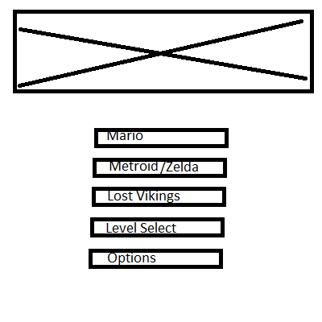
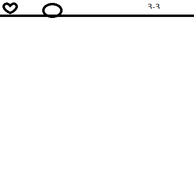

# Plan Presentation
Team 20: Super CS307 Bros

Matt Bowman, Sam Lamba, Joe Heflin, Roshni Penmatcha

## Implementation Plan

### Genre: Platformers
* Static obstacles
* Movable enemy entities
* Player can take some actions to navigate
* Some goal or victory condition

### Features
1) Three distinct games:
    * Mario-style classic platformer
    * Metroid-style (health, combat focused)
    * Lost Vikings style, gimmick based
2) Unique art for each game
3) Completely rebindable keys
4) Level editor for designing custom levels for each game with the ability to play them (Reach)
5) Infinite mode that generates level as you progress and tracks high score (Reach)

### Responsibilities:

* Matt: Data/Config management and Control (Main Driver class, Properties, keybindings, etc)
* Sam: Game objects and specific implementations for each game
* Roshni: Game classes (physics engine, victory conditions)
* Joe: Visualization (Menus and GameView)

### Sprint Plans:
* Sprint 1: Functional Mario game (reading files in, displaying rectangles on screen, starting game from menu)

* Sprint 2: implement all game types, better graphics, level transitions, escape back to main menu

* Sprint 3: Reprogrammable keys, level select, cheat keys, high score, infinity mode, editor

### User interaction:

### Design Goals
##### Open aspects vs. Closed aspects

### Module Overview
Driver, Loader, Display, Game

### API examples
##### Gameplay
##### Loader

### Use Cases 
##### Data read in to initialize game.
##### User Selects game 

### Alternative Design: where to place runnable class.
